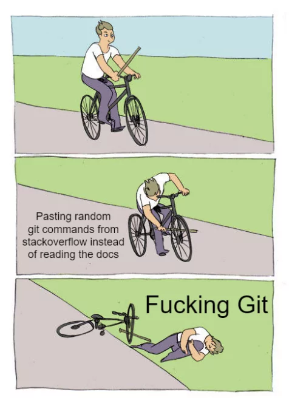

# Git & Github Tricks

Collection for useful Git & Github stuff.


## Creating a remote repo at your terminal

Use this command inside your local project folder via Terminal if you dont want to open github at your browser everytime.

```bash

gh repo create

```

Make sure to hit the second answer "Push to existing local repo..." with the ⬇️ key.

```bash
1. ? What would you like to do? Push an existing local repository to GitHub
2. ? Path to local repository .
3. ? Repository name yourRepoName
4. ? Repository owner yourUserName
5. ? Description Challenges: This is a example description
6. ? Visibility Public
7. ✓ Created repository yourUserName/yourRepoName on GitHub
8. ? Add a remote? Yes
9. ? What should the new remote be called? main
10. ✓ Added remote git@github.com:yourUserName/yourRepoName.git
11. ? Would you like to push commits from the current branch to "main"? Yes
```

Follow the instrcutions after executing this command. Like at this example above.

> ## Important❗️
>
> - Make sure you choose **yes** ✅ at "Add a Remote?" (like at line 8.)
>
> - Use **main** as your branchname (like at line 9.)
>
> - Choose **yes** ✅ at line 11.
>
> <br>

## The complete git worklfow

All commands to create a new Repo and push your code to it.

### 1. Create your local repo aka project

```bash
mkdir projectname
cd projectname
git init
touch README.md
git add .
git commit -m 'Initial commit'
```

### 2. Create your remote repo

```bash
gh repo create
```

## To be continued


